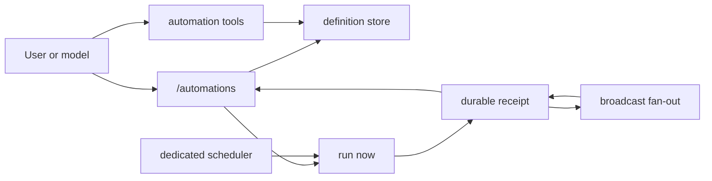

# Automation — Shaping

The source and outcome are captured in `automation-frame.md`. This document is authoritative for
requirements and the selected system shape. `automation-slices.md` is authoritative for build
order.

## Requirements

| ID | Requirement | Status |
| --- | --- | --- |
| R0 | A natural-language automation request uses a Ziggy-owned capability immediately instead of probing another product or guessing shell syntax. | Core goal |
| R1 | Automation definitions and execution state stay Profile-owned, inspectable, and separate from `.claw` or another runtime's state. | Must-have |
| R2 | The TUI can create, list, inspect, modify, pause, resume, run, and remove automations and show next-run and last-run state. | Must-have |
| R3 | Scheduled work runs while the TUI is closed and resumes after login or scheduler restart without depending on a channel gateway. | Must-have |
| R4 | Every admitted run leaves a durable local result; an open TUI can notice it and a reopened TUI can catch up. | Must-have |
| R5 | One run can broadcast to zero or more explicit Telegram, Discord, and Slack destinations, with a truthful outcome for each target. | Must-have |
| R6 | A scheduled firing is claimed before model work, is never replayed after claim, cannot overlap another run of the same automation, and does not block different automation IDs. | Must-have |
| R7 | Ziggy never reports an automation as verified without proving the definition, scheduler ownership when scheduled, local result, and requested delivery outcomes. | Must-have |
| R8 | Automation tools are bound to the current Profile and never accept a path to another Profile. | Must-have |

## Shapes

### A: TUI-owned scheduler

| Part | Mechanism | Flag |
| --- | --- | :---: |
| A1 | `/automations` owns definitions, due-time polling, execution, and result rendering in the interactive process. | |
| A2 | Closing the TUI stops polling; the next TUI start catches up from the latest unclaimed schedule. | |

### B: Dedicated Profile scheduler

| Part | Mechanism | Flag |
| --- | --- | :---: |
| B1 | `AutomationStore` owns typed Markdown definitions under `<profile>/automations/`; all CLI, tools, TUI, and scheduler calls use it. | |
| B2 | One hidden Ziggy Pi extension exposes Profile-bound `automation_*` tools plus `/automations`, backed by the same application service. | |
| B3 | Every manual or scheduled run writes one bounded Markdown receipt under `<profile>/.runtime/automations/runs/`; the TUI reads the latest receipts on open. | |
| B4 | `ziggy scheduler <profile>` is the only due-time owner, holds a crash-safe Profile scheduler lease, and enters the same claim-before-Pi runner as Run now. | |
| B5 | A Profile-specific launchd or systemd-user service owns scheduler startup and heartbeat independently of TUI and channel processes. | |
| B6 | Delivery fans out from the locally persisted reply to typed Telegram, Discord, and Slack targets and records one outcome per target. | |
| B7 | An always-admitted automation guidance skill and direct tool descriptions route matching requests without external capability search. | |

### C: One operating-system job per automation

| Part | Mechanism | Flag |
| --- | --- | :---: |
| C1 | Creating or changing an automation writes both its Profile definition and a matching launchd job that invokes `ziggy wake`. | |
| C2 | The TUI derives status by joining Profile files with launchd job state. | |

### D: Merlin/Claw compatibility bridge

| Part | Mechanism | Flag |
| --- | --- | :---: |
| D1 | A Ziggy skill teaches the agent to invoke Merlin's `claw cron` commands. | |
| D2 | The TUI reads `.claw/profile/crons.json` and Claw run state as a compatibility projection. | |

## Fit check

| Req | Requirement | Status | A | B | C | D |
| --- | --- | --- | :---: | :---: | :---: | :---: |
| R0 | A natural-language automation request uses a Ziggy-owned capability immediately instead of probing another product or guessing shell syntax. | Core goal | ✅ | ✅ | ✅ | ❌ |
| R1 | Automation definitions and execution state stay Profile-owned, inspectable, and separate from `.claw` or another runtime's state. | Must-have | ✅ | ✅ | ❌ | ❌ |
| R2 | The TUI can create, list, inspect, modify, pause, resume, run, and remove automations and show next-run and last-run state. | Must-have | ✅ | ✅ | ✅ | ✅ |
| R3 | Scheduled work runs while the TUI is closed and resumes after login or scheduler restart without depending on a channel gateway. | Must-have | ❌ | ✅ | ✅ | ✅ |
| R4 | Every admitted run leaves a durable local result; an open TUI can notice it and a reopened TUI can catch up. | Must-have | ✅ | ✅ | ✅ | ✅ |
| R5 | One run can broadcast to zero or more explicit Telegram, Discord, and Slack destinations, with a truthful outcome for each target. | Must-have | ✅ | ✅ | ✅ | ✅ |
| R6 | A scheduled firing is claimed before model work, is never replayed after claim, cannot overlap another run of the same automation, and does not block different automation IDs. | Must-have | ❌ | ✅ | ❌ | ❌ |
| R7 | Ziggy never reports an automation as verified without proving the definition, scheduler ownership when scheduled, local result, and requested delivery outcomes. | Must-have | ❌ | ✅ | ❌ | ❌ |
| R8 | Automation tools are bound to the current Profile and never accept a path to another Profile. | Must-have | ✅ | ✅ | ❌ | ❌ |

Shape B is selected. A makes the TUI an execution dependency. C splits authority between Profile
files and host jobs and does not provide one claim boundary. D is the failure mode observed in
Yoko: it creates a second product authority and cannot truthfully deliver into Ziggy.

## Detail B: affordances

### TUI affordances

| ID | Affordance | User action | Wires out |
| --- | --- | --- | --- |
| U1 | `/automations` list: name, enabled state, schedule, next run, last result, scheduler status | Open list; Up/Down selects | U2, N1, N3, N4 |
| U2 | Automation detail: prompt, timezone, delivery targets, last local output, per-target outcomes | Enter opens; Escape returns | U3, U4, U5, U6, N1, N3 |
| U3 | Create/edit form | Save a typed definition | N1 |
| U4 | Pause/resume action | Toggle enabled state | N1 |
| U5 | Run-now action | Start one manual run | N2 |
| U6 | Remove confirmation | Delete one definition without deleting prior receipts | N1 |
| U7 | New-result notification | Open the corresponding receipt | U2, N3 |

### Non-UI affordances

| ID | Affordance | Owner and contract | Wires out |
| --- | --- | --- | --- |
| N1 | Automation store | Application service atomically reads and writes typed Profile Markdown definitions | U1, U2, N4 |
| N2 | Automation runner | Claims a manual or scheduled trigger, opens one fresh Pi session, and persists the local result before delivery | N3, N5 |
| N3 | Receipt store | Atomically persists bounded run state, local output, and per-target delivery outcomes | U1, U2, U7 |
| N4 | Dedicated scheduler | Holds one Profile lease, derives due firings, calls N2, and publishes heartbeat/status | U1, N2 |
| N5 | Delivery fan-out | Sends the persisted reply to each explicit channel target and updates only that target's receipt outcome | N3 |
| N6 | Automation Pi surface | Always-admitted guidance plus Profile-bound tools translate natural language into N1/N2 calls | N1, N2 |

## State and invariants

Definitions are authoritative under `automations/`. Claim state and bounded receipts are runtime
state under `.runtime/automations/`. The TUI displays projections of those stores plus live
scheduler status; it never owns execution.

The shared runner claims a canonical `(automation ID, scheduled instant)` before starting Pi.
A claimed firing is at-most-once and is not replayed after restart. Stale running receipts become
unknown without retry. Restart or sleep catches up at most one latest firing inside 15 minutes and
records older work as skipped. The local reply is persisted before any broadcast. Each delivery
target can succeed or fail independently, and partial delivery is never reported as full success.

Global shell/filesystem confinement is a separate Profile-security workstream. This shape enforces
the narrower automation invariant: its tools derive the active Profile from runtime context and
accept no arbitrary Profile path or external automation binary.
