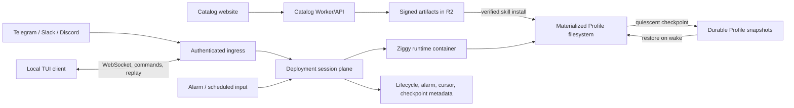

# Cloud-first Ziggy wayfinder and continuation packet

Status: planning and research handoff captured on 2026-07-31 from branch `cleanup`, whose
pre-documentation HEAD was `c0a17eb145dd007713854f99470503c271fc419d`. No cloud runtime has
been implemented or deployed by this work.

This document is the self-contained continuation point for turning the current local Ziggy into
an independently managed, cloud-first deployment. It records the desired destination, decisions
made with the user, current implementation truth, proof performed during the session, platform
research, proposed vertical slices, unresolved Wayfinder tickets, dependencies, fog, and explicit
scope boundaries.

Read the deeper primary-source platform note alongside this document:
[`docs/research/cloud-hosted-ziggy-platforms.md`](../research/cloud-hosted-ziggy-platforms.md).

## Resume here in a later session

1. Check out and update `cleanup` without rewriting it:

   ```sh
   cd /Users/yesh/code/personal/ziggy
   git switch cleanup
   git pull --ff-only origin cleanup
   git status -sb
   ```

2. Read this document, `docs/research/cloud-hosted-ziggy-platforms.md`,
   `docs/research/minimal-ziggy-scout.md`, and `docs/research/pi-sdk-surface.md`.

3. Re-check the live source before treating any line reference or package count here as current.

4. Resume Wayfinder at the first unclaimed frontier decision, **Choose the hermetic runtime and
   resource contract**. Resolve one decision ticket per session unless a new research ticket is
   being resolved in parallel.

5. Do not begin the hosting implementation until the artifact, resident-service, and Profile
   durability contracts are explicit. The fastest executable build is not yet the whole hosted
   system.

## Destination

Reach an implementation-ready cloud architecture and ordered delivery plan for Ziggy where each
deployment is one isolated Profile, all authoritative execution and state live in the cloud,
scheduled automations and gateways keep working without a local machine, and an authenticated
local TUI can attach as a client.

The architecture must support many such deployments, but each deployment is provisioned and
managed independently for now. It must preserve Ziggy's Profile-as-folder model and Pi-owned agent
runtime rather than replacing them with a second agent framework or conversation store.

The destination is reached when the remaining choices are implementation details with acceptance
tests, not unresolved product or architecture decisions.

## Settled decisions

### Put all authority in the cloud

There is no local execution fallback in this effort. The hosted Ziggy owns the Profile, Pi runtime,
sessions, memory, skills, automations, gateway connections, and active work. A laptop or desktop
may run a TUI client, but that client never becomes the authoritative runtime or state owner.

### Make one deployment equal one Profile

A deployment contains exactly one Profile. Its isolation boundary includes Profile files, provider
credentials, gateway secrets, sessions, automation definitions and receipts, installed skills,
Profile-authored skills, runtime state, and backups.

Many deployments are allowed. Multi-Profile routing inside one deployment is deliberately avoided.

### Manage deployments independently for now

There is no shared fleet control plane in the first destination. The same deployment template may
be instantiated many times, but each instance has its own URL, secrets, lifecycle, and storage.

A future fleet manager may provision or list them, but it is outside this map and must not become a
hidden prerequisite for the first hosted Profile.

### Permit scale-to-zero without interrupting work

An idle deployment may sleep. A cron occurrence, gateway event, or TUI attachment must be able to
wake it. Active Pi work must not be killed merely because the initiating HTTP request or client
connection ended.

The authoritative lifecycle distinction is therefore:

- idle and checkpointed: safe to sleep;
- starting or restoring: not ready for new work;
- active: must remain alive;
- quiescing and checkpointing: reject or queue conflicting mutation;
- failed to checkpoint: remain recoverable and do not claim a safe sleep.

### Keep the local TUI as a remote client

The local TUI must eventually connect over an authenticated remote protocol. It should attach,
stream ordered events, reconnect, replay missed events, prompt, steer, cancel, and display status.
It must not read or mutate the Profile filesystem directly.

The exact owner/device identity model was not settled. The earlier recommendation was one owner
with separately revocable device credentials, but the user redirected the discussion before
confirming it. This remains an open decision.

### Preserve self-authored Profile skills

The hosted Profile can continue to create and edit its own skills. These skills are Profile-owned
content and survive sleep, redeploy, and restore. They are not automatically published to the
approved catalog and do not require catalog approval merely to exist in their own Profile.

Their provenance is different from catalog skills, but their effect is still constrained by the
runtime's tool and egress authority. Skill text can persuade an agent to invoke powerful tools; a
"text-only" label does not make the resulting behavior harmless.

### Add an approved remote catalog

A website should let a deployment discover and add reviewed skills and extensions. The catalog is
not the Profile's state store and is not a reason to keep the Ziggy checkout on the runtime host.

Approved skills and executable extensions must not share one trust path:

- an approved skill is an immutable content bundle installed only after manifest, digest, path,
  and signature verification;
- an executable Pi extension runs TypeScript with host permissions and initially should ship in a
  reviewed, pinned runtime image or an equivalently signed startup-only code bundle;
- a package containing both skill content and extension code inherits the executable-code boundary;
- a running agent must not be able to mutate R2 content and thereby promote it into trusted code.

## Domain language

Use these terms consistently in later planning and code:

- **Profile**: the authoritative folder containing one Ziggy's soul, memory, sessions, skills,
  automations, configuration, and runtime-owned durable files.
- **Deployment**: one independently managed cloud installation that owns exactly one Profile and
  one Ziggy runtime lifecycle.
- **Runtime artifact**: the hermetic executable or image containing Ziggy, Pi, and always-admitted
  internal resources. It is immutable during a deployment version.
- **Catalog**: the remote index of reviewed, immutable capability artifacts. It is a distribution
  source, not live Profile state.
- **Profile skill**: skill content installed or authored under the Profile and admitted by Pi.
- **Extension**: executable Pi package code with host permissions. It is code deployment, not just
  content synchronization.
- **Ingress**: authenticated HTTP, webhook, WebSocket, or scheduled input entering a deployment.
- **Attach client**: a TUI or future UI that observes and commands the cloud runtime through a
  protocol without owning Profile state.
- **Materialized Profile**: the ordinary POSIX directory presented to Pi while a runtime is active.
- **Checkpoint**: a versioned, integrity-protected durable representation of the Profile made only
  at a defined consistency boundary.
- **Quiescent**: no active Pi turn, no uncommitted Profile mutation, and safe to publish a checkpoint
  or stop compute.
- **Control/session plane**: routing, authentication, wake scheduling, attachment, replay cursors,
  lifecycle metadata, and checkpoint coordination.
- **Execution plane**: the Linux process environment in which Bun, Pi, tools, and the materialized
  Profile run.

## Current implementation truth

### What works now

The current checkout is one Bun/TypeScript runtime over
`@earendil-works/pi-coding-agent@0.82.0`. It already supports:

- non-destructive Profile initialization and Profile discovery;
- provider/model authentication through Profile files;
- local one-shot runs and an in-process Pi `InteractiveMode` TUI;
- Profile-installed and Profile-authored skills;
- Profile-admitted Pi extensions;
- Profile memory and sessions stored as files;
- Profile-owned automation definitions, durable run receipts, scheduling, and delivery;
- launchd and systemd-user installation for the local scheduler;
- Telegram long polling, Discord Gateway, and Slack Socket Mode as independent foreground gateway
  loops.

The Profile is already close to the desired durable data unit. The process and distribution model
are still local-first.

### Why the installed command hardcodes Bun and the checkout

`package.json` declares `src/main.ts` directly as `bin.ziggy` and has no production build script.
The installed `/Users/yesh/commands/ziggy` is a small native launcher, not a Bun standalone bundle.
Inspection showed that it embeds these two paths:

```text
/opt/homebrew/bin/bun
/Users/yesh/code/personal/ziggy/src/main.ts
```

That launcher shape follows the original local-first specification, which explicitly excluded a
compiled-executable gate, daemon, attach client, socket protocol, and replay layer. It is not a
limitation of Bun or Pi.

### Live standalone compile proof

The exact current entrypoint was compiled without source changes:

```sh
bun build src/main.ts --compile --outfile /tmp/<audit>/ziggy
```

Observed result:

- the generated macOS arm64 executable was approximately 72 MB;
- it contained the Bun runtime and application dependency graph;
- it did not contain the hardcoded Homebrew Bun path or checkout entrypoint path;
- it ran without the source checkout or external Bun runtime;
- `profiles` worked;
- `init cloud-test` created a valid Profile;
- `skills list cloud-test` reported no installed or available skills.

The empty catalog is the important failure. It proves that application code is bundleable while
the current resource contract is not hermetic.

### Why the catalog disappears in the compiled executable

Production constructs `repositoryRoot` from `import.meta.dir` and uses ordinary filesystem walks
to discover:

- repository `extensions/*/skills` directories;
- repository top-level `skills/*` directories;
- the hidden internal skill directory;
- catalog source trees used by `ziggy skills add`.

Those directory trees are not imported into the module graph, so the basic `bun build --compile`
does not include them. The current pinned Bun CLI also did not expose the newer documented
directory `--asset` flag during the audit. A generated asset manifest, explicit imports, a sidecar
resource directory, a pinned Bun upgrade, or the remote catalog can solve this, but the production
contract must be chosen rather than inferred from the checkout.

### The compiled `/skills` path has a second source dependency

The hidden TUI extension installs a catalog skill by spawning:

```text
process.execPath <repositoryRoot>/src/main.ts skills add <profile> <id>
```

In source mode, `process.execPath` is Bun and the second argument is the TypeScript entrypoint. In a
compiled executable, `process.execPath` is Ziggy itself; passing a source path after it no longer
means "run this TypeScript file." This boundary should become a direct application-service call or
a stable self-invocation contract.

### What is not hosted today

There is no Dockerfile, Wrangler configuration, Fly configuration, deploy command, HTTP control
plane, remote attach protocol, cloud identity boundary, cloud Profile persistence adapter,
checkpoint protocol, cloud backup/restore flow, gateway supervisor, or deployed catalog.

The scheduler service is tailored to launchd and systemd-user. Telegram, Discord, and Slack each
run as separate resident commands. The TUI constructs and owns the same local Pi runtime it renders.

## Recommended architecture

The control/session plane and execution plane must remain distinct even when one provider hosts
both:



The runtime remains Pi-backed. Eve and Flue are comparison points for boundaries, not replacement
runtimes.

## How each platform fits

### Cloudflare

Cloudflare is the recommended edge-native target after the simpler hosted proof.

Use Cloudflare Pages for the catalog website, a Worker for catalog and deployment ingress, a
Durable Object keyed to the independent deployment for serialized lifecycle authority, a
Cloudflare Container for the Linux/Bun/Pi execution plane, and R2 for immutable catalog artifacts
and Profile snapshots.

Durable Object responsibilities:

- authenticate and route ingress to the right independent deployment;
- own lifecycle transitions and prevent concurrent restore/checkpoint/sleep races;
- store small, strongly consistent metadata such as checkpoint versions, digests, alarm state,
  accepted input IDs, replay cursors, and delivery receipts;
- arm the next dynamic automation occurrence through its alarm;
- accept hibernating WebSockets for remote TUI attachments;
- keep active-work state separate from attachment state so disconnect does not cancel work.

Container responsibilities:

- run the immutable Ziggy artifact in Linux;
- materialize the selected Profile snapshot before declaring readiness;
- execute Pi turns, tools, gateways, and automation work;
- report activity and quiescence;
- publish a new checkpoint before safe sleep;
- fail closed if restore or checkpoint validation fails.

The current Cloudflare constraint is decisive: container disk is ephemeral. After sleep, a new
instance starts from the image with a fresh disk. Cloudflare documents container snapshots as
coming later and allows R2-backed FUSE with non-SSD semantics. Therefore Cloudflare cannot simply
mount today's Profile folder and call the problem solved. Ziggy must own materialization,
checkpointing, and recovery, or consciously accept a FUSE contract after testing Pi's filesystem
behavior against it.

Cloudflare Cron Triggers are useful for fixed deployment-time schedules, but Ziggy automation
definitions are user-editable Profile state. A Durable Object alarm is the better dynamic primitive:
store all schedules, arm the next due occurrence, process idempotently, then arm the next one.

Gateway scale-to-zero requires transport work. The current outbound Telegram poll, Discord
WebSocket, and Slack Socket Mode connections keep compute resident. Webhook-capable paths can move
ingress to the Worker and wake the container. Any gateway that requires a continuous outbound
socket means that deployment stays awake while the gateway is enabled, unless its transport is
changed.

### Fly.io

Fly Machines plus one Fly Volume is the shortest faithful hosted proof because a Volume is an
ordinary persistent POSIX directory. The first cloud proof can mount the Volume as the Profile,
run a normal OCI image, expose one service, and use Fly Proxy autostart/autostop.

This path avoids inventing Profile snapshot materialization before proving the runtime artifact,
resident service, remote attachment, gateway ownership, and sleep safety.

Fly is not automatically durable enough for the final system:

- a Volume belongs to one server and region;
- it attaches to one Machine;
- Fly does not automatically replicate it;
- root filesystems remain ephemeral;
- snapshots are not the same as application-level verified backups;
- detached work can be killed if the Machine is treated as idle after an HTTP response closes.

Ziggy must expose its own active/quiescent signal and keep the Machine alive until work is safe.
Backups and a restore drill are required before a Fly Volume becomes the only Profile copy.

### Vercel

Vercel is appropriate for the catalog website and can be an execution backend through Vercel
Sandbox, but ordinary Vercel Functions are not the resident Ziggy host. Function invocations have
bounded duration and no mounted durable Profile filesystem.

Vercel Sandbox separates session duration from filesystem persistence. A persistent sandbox can
snapshot files on stop and resume later in a new VM session. That can model a Profile, but it is a
snapshot lifecycle rather than a continuously mounted volume and still requires explicit runtime
coordination, gateway strategy, restore readiness, and active-work completion.

Use it later if its snapshot and duration contract is preferable to owning R2 materialization. Do
not mistake "made by Vercel" for "runs as a Vercel Function."

### Eve

Vercel's Eve is close in product shape: an authored agent directory contains instructions, tools,
skills, channels, and schedules. Eve separates durable Workflow SDK execution from per-session
sandbox filesystem/process execution. A workflow can park or restart independently from sandbox
compute.

The useful lesson is the separation between trusted durable orchestration and replaceable sandbox
compute. Ziggy should keep that separation but retain the Profile and Pi session files as its own
durable product state instead of adopting Eve's framework or conversation model.

### Flue

Astro's Flue is a runtime/harness reference. It separates conversation persistence from workspace
persistence, offers a common sandbox interface, and supports provider adapters including local,
Cloudflare, and Vercel-backed execution. Its Cloudflare deployment combines Durable Object state
with a sandbox adapter rather than pretending Durable Object SQLite is a POSIX workspace.

The useful lesson is adapter separation: hosting, persistence, and sandbox lifecycle are replaceable
boundaries around the agent harness. Ziggy should apply that shape to its existing Effect/Pi
boundaries rather than replacing Pi with Flue.

## Ordered vertical slices

These are implementation slices, not Wayfinder decision tickets. Do not start a slice until the
decisions that define its contract are closed.

### Slice 1: Hermetic runtime artifact

Deliver a macOS and Linux Ziggy artifact that does not require Bun, `node_modules`, a source
checkout, or absolute developer-machine paths. Define immutable runtime resources separately from
the mutable Profile and remote catalog. Remove the source-path subprocess from TUI skill install.

Acceptance:

- run from an empty directory on a machine without Bun or the checkout;
- initialize one Profile;
- authenticate or use a deterministic fake-provider smoke;
- create and load a Profile-authored skill;
- install a fixture catalog skill through the production boundary;
- load an admitted fixture extension if external extension loading remains supported;
- run one prompt, persist the session, restart, and continue it;
- prove the artifact reports its version and build identity;
- compile for Linux in CI and reject missing embedded runtime resources.

### Slice 2: Signed catalog and Profile capability installation

Deliver the catalog website, versioned manifest, content-addressed artifact store, and runtime
installer. Start with skills. Treat executable extension activation as a deployment/restart
operation rather than a hot content copy.

Acceptance:

- list approved catalog entries without reading the Ziggy checkout;
- verify manifest and full-tree digests before writing the Profile;
- reject traversal, symlinks, undeclared files, digest mismatch, and mutable artifact identities;
- install atomically without overwriting a human-modified Profile skill unless explicitly chosen;
- retain Profile-authored skills during catalog refresh;
- work with an unavailable catalog after already-installed skills are present;
- record installed origin, version, and digest without making that metadata the loading authority.

### Slice 3: One-Profile resident service

Deliver one cloud process contract, tentatively `ziggy serve <profile>`, that owns all resident
runtime concerns for one Profile. It should replace unrelated scheduler/gateway foreground process
ownership inside a deployment.

Acceptance:

- restore and validate one Profile before readiness;
- supervise scheduler and configured gateways;
- serialize or safely coordinate Profile mutations;
- expose liveness, readiness, activity, and quiescence;
- survive client disconnect while a turn is active;
- drain and checkpoint on SIGTERM;
- refuse safe-stop acknowledgement when checkpointing fails;
- restart and resume sessions, receipts, schedules, and gateway delivery cursors.

### Slice 4: Remote attachment and ingress

Deliver an authenticated protocol and compiled local TUI client. Route gateway and automation
inputs through the same application/runtime authority rather than parallel agent hosts.

Acceptance:

- attach from a local TUI without local Profile access;
- stream ordered events and replay from a durable cursor after reconnect;
- submit prompt, steer, cancel, and status operations with stable request IDs;
- distinguish accepted, started, completed, failed, and interrupted work;
- revoke one device without rotating every gateway secret;
- prevent cross-deployment access;
- prove duplicate ingress does not duplicate accepted work;
- preserve an active run across TUI disconnect and Durable Object hibernation.

### Slice 5: Hosted proofs and Cloudflare promotion

First deploy the resident service to Fly with one Volume, backup, restore, auto-wake, and safe-idle
proof. Then implement the Cloudflare Profile snapshot adapter and move the same runtime contract to
Worker + Durable Object + Container + R2.

Fly acceptance:

- deploy one Profile from an image and Volume;
- wake it through HTTP/TUI ingress and a scheduled occurrence;
- keep it alive through an active run after client disconnect;
- sleep only after quiescence;
- restore from backup into a replacement Machine;
- demonstrate a configured gateway and a remote TUI against the same Profile.

Cloudflare acceptance:

- restore a validated Profile snapshot into a fresh container disk;
- block readiness until restore is complete;
- serialize mutation and checkpoint publication;
- publish immutable R2 snapshots with DO-owned version/digest metadata;
- wake through ingress, WebSocket activity, and a dynamic automation alarm;
- keep TUI WebSockets hibernatable without claiming the Pi process is still alive;
- survive forced container replacement without losing acknowledged work;
- reject stale or conflicting checkpoint publication;
- roll the runtime image forward and backward without silently downgrading Profile data.

## Wayfinder state

This section preserves the decision map in a local handoff document because this session did not
create a canonical tracker map. On resumption, promote these named tickets to the configured issue
tracker, create them before wiring their blocking edges, and keep the map as an index rather than
duplicating ticket resolutions.

### Decisions so far

- **Put all Ziggy authority in the cloud** — no local runtime; local surfaces are clients.
- **Use one Profile per deployment** — Profile, runtime, credentials, gateways, and schedules share
  one isolation and lifecycle boundary.
- **Allow many independently managed deployments** — a fleet control plane is deferred.
- **Permit safe scale-to-zero** — idle deployments may sleep, but active work must finish and state
  must be durable before stop.
- **Keep the TUI as an attach client** — it connects remotely and never owns Profile files.
- **Preserve Profile self-authored skills** — local-to-Profile capability authoring remains valid
  and durable.
- **Add an approved capability catalog** — reviewed capabilities are remotely discoverable, while
  trust differs for skill content and executable extensions.
- **Keep Pi as the runtime** — Eve and Flue supply comparison patterns, not a replacement agent
  loop or state model.

### Frontier decisions

#### Choose the hermetic runtime and resource contract

Type: `wayfinder:grilling`, supported by the completed compile task.

Question: Which resources are embedded in the standalone artifact, which ship as immutable image
or sidecar content, which come from the remote catalog, and how does the same code locate them in
source, compiled, and container modes without a checkout?

Recommendation: embed only always-admitted Ziggy resources, make the reviewed executable extension
set part of the runtime release, fetch signed skills from the catalog, and keep Profile resources
under the Profile. Use one explicit runtime-resource abstraction rather than path heuristics.

Unblocked and first in order.

#### Choose the approved catalog trust and update model

Type: `wayfinder:grilling` with focused security research as needed.

Question: Who approves artifacts, how are manifests and signatures produced, what can a deployment
install without restart, and what happens when an installed capability is modified locally or
revoked upstream?

Recommendation: Git-reviewed publishing produces immutable, content-addressed bundles and a signed
manifest. Skills install atomically into Profiles; executable extensions select a pinned runtime
release. Revocation blocks new installs and raises status but does not silently delete Profile files.

Unblocked and may run in parallel with the runtime-resource decision.

#### Choose the resident service ownership and lifecycle contract

Type: `wayfinder:grilling`.

Question: What single process or supervisor owns Pi runs, scheduler ticks, gateways, mutation
serialization, health, quiescence, and shutdown for one hosted Profile?

Recommendation: add one `ziggy serve` application entrypoint with Effect-scoped fibers and one
Profile lease. Host adapters deliver ingress and lifecycle signals; they do not create parallel Pi
authorities.

Unblocked and may run in parallel with the artifact decision.

#### Choose the remote attachment protocol and identity model

Type: `wayfinder:prototype` plus `wayfinder:grilling`.

Question: What protocol events, commands, replay semantics, owner/device credentials, revocation,
and reconnect states let Pi's TUI become a remote renderer without leaking Profile authority?

Recommendation: prototype one owner with revocable device credentials, request IDs, monotonically
ordered durable events, replay cursors, and explicit accepted/started/terminal receipts.

Blocked by **Choose the resident service ownership and lifecycle contract**.

#### Choose gateway transports under scale-to-zero

Type: `wayfinder:research` followed by `wayfinder:grilling`.

Question: For Telegram, Discord, and Slack, which current resident transports remain acceptable,
which can become verified webhook ingress, and which configurations intentionally keep a deployment
awake?

Recommendation: prefer Worker-verified webhook ingress where the platform supports the required
event surface. Treat a required outbound gateway socket as an explicit always-awake capability
until a safe edge adapter exists.

Blocked by **Choose the resident service ownership and lifecycle contract**.

#### Choose the first hosted proof and promotion gate

Type: `wayfinder:grilling`; the platform research is complete.

Question: Is Fly Machines plus a Volume accepted as the first proof before the Cloudflare-native
snapshot layer, and what evidence must pass before work moves from Fly to Cloudflare?

Recommendation: accept Fly as a disposable proof backend, not final authority. Require artifact,
resident lifecycle, remote attach, active-run survival, backup, and restore proof before beginning
Cloudflare materialization.

Blocked by **Choose the hermetic runtime and resource contract** and **Choose the resident service
ownership and lifecycle contract**.

#### Choose the Cloudflare Profile checkpoint protocol

Type: `wayfinder:prototype` supported by completed platform research.

Question: What is the authoritative snapshot format, consistency boundary, version/digest protocol,
restore validation, conflict rule, backup retention, and crash recovery when DO metadata and R2
objects advance separately?

Recommendation: DO metadata is the commit record, R2 snapshots are immutable objects, and the
container publishes by upload-then-atomic-metadata-advance. Only quiescent generations may publish;
stale generations fail without overwriting the current pointer.

Blocked by **Choose the resident service ownership and lifecycle contract** and informed by the
Fly proof.

#### Choose backup, restore, update, and rollback guarantees

Type: `wayfinder:grilling`.

Question: What data-loss window, retention, restore drill, runtime/Profile compatibility rule,
secret recovery, and rollback behavior are required before a deployment is considered self-
sufficient?

Recommendation: no acknowledged Profile mutation is lost; keep versioned encrypted backups; test
restore into a fresh deployment; make migrations explicit and forward-compatible; never treat an
image rollback as an automatic Profile rollback.

Blocked by **Choose the first hosted proof and promotion gate** for provider-specific evidence, but
the product requirements can be grilled earlier.

### Completed research and task evidence

- **Prove the current Ziggy entrypoint can compile standalone** — succeeded. The 72 MB executable
  ran Profile initialization without Bun or the checkout; catalog discovery failed because the
  resource trees were not embedded.
- **Compare Cloudflare, Fly, Vercel Sandbox, Eve, and Flue** — completed in
  `docs/research/cloud-hosted-ziggy-platforms.md` from first-party documentation and source.
- **Audit current local self-sufficiency** — completed. Local developer launch is cohesive, but the
  installed launcher, resident processes, and repository catalog are not a portable deployment.

### Not yet specified

These areas are in scope but remain fog until earlier decisions clear them:

- exact Profile snapshot archive format, chunking, encryption, and incremental strategy;
- runtime release manifest, extension-to-image mapping, and Profile compatibility metadata;
- gateway-specific webhook feasibility and delivery cursor ownership;
- remote TUI wire encoding, backpressure, terminal feature parity, and protocol versioning;
- active-work detection across Pi turns, tool subprocesses, gateway sends, and automation delivery;
- provider credentials and OAuth refresh persistence across container replacement;
- Cloudflare Access versus an application-owned device credential protocol;
- observability, redaction, audit events, quotas, and cost controls per independent deployment;
- safe skill-created scripts and executable dependencies inside the runtime sandbox;
- regional placement, latency expectations, disaster recovery region, and restore objectives;
- update UX for the runtime artifact, approved catalog, and Profile-authored capabilities.

### Out of scope

- local-machine execution as an authority or failover path;
- multiple Profiles inside one deployment;
- a shared fleet control plane for creating and managing deployments;
- multi-user roles, collaborative TUI sessions, or team tenancy;
- automatic publication of self-authored Profile skills to the approved catalog;
- hot-loading arbitrary executable extension code fetched by the running agent;
- replacing Pi with Eve, Flue, or another agent framework;
- a general browser application beyond the approved catalog and required authenticated ingress;
- high availability through simultaneous writers to one Profile;
- implementing the cloud runtime as part of this documentation handoff.

## Recommended next decision

Resume with **Choose the hermetic runtime and resource contract**. The first concrete question is:

> Should the production runtime embed only Ziggy's always-admitted internal resources and obtain
> every optional skill from the signed catalog, while reviewed executable extensions are fixed by
> the runtime image version?

The recommendation is yes. It creates three explicit authorities—immutable runtime code,
catalog-distributed reviewed content, and mutable Profile-owned content—and removes the checkout
from production without weakening the extension trust boundary.

Do not implement until that decision is confirmed and its compile smoke is written as the Slice 1
acceptance contract.
