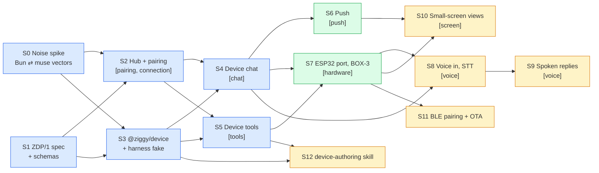

# Devices

Ziggy is the main thing running on the user's machine. Devices — an ESP32 board with a screen and
mic, a Pi, anything that can open a WebSocket — connect to it and give the Profile a body: a place
to talk to it, tools it can call, and a screen it can show things on.

This is the device counterpart of [Plugins](../../operations/plugins.md). A plugin is a folder Ziggy runs;
a device is hardware that dials in and brings its own tools, its own face and its own surface.

We borrow code from Meta's Apache-2.0
[muse-gadget-sdk](https://github.com/facebookincubator/muse-gadget-sdk) (drivers, `noise_core`,
UI, audio capture, BLE pairing crypto). We do **not** speak the Muse server protocol: no
`api.muse.ai`, no `fetch_vms`, no device tokens, no protobuf stream mux, no Muse-compatible edge.

## Requirements

| Id | Requirement |
|---|---|
| R0 | Devices are off unless `<profile>/devices.json` exists. With it absent the resident listens on loopback only. |
| R1 | A device reaches exactly one Profile, the one it was paired to. An unpaired or revoked key is refused at the handshake. |
| R2 | No public TLS certificate is required. Noise_XX with keys pinned at pairing protects `ws://` on a LAN and `wss://` through a tunnel alike. |
| R3 | A device's commands are tools (`device__<id>__<cmd>`) in the Profile's sessions and obey the same allowlists as every other tool. An offline device fails the call; it never hangs the turn. |
| R4 | A device is a channel: one session per device, streamed reply, abort. |
| R5 | Ziggy can push to a device without being asked (automations, `notify`, `display.show`). |
| R6 | Voice reaches Muse parity: push-to-talk, transcript, streamed reply on screen; then exceeds it with spoken replies. |
| R7 | No device secret in plaintext in the Profile. Ziggy's static private key lives in the Keychain; the registry holds only public keys. |
| R8 | The protocol is versioned (`zdp/1`) and both SDKs pass one conformance suite. |

## Decisions

- **Protocol ZDP/1.** Device opens a WebSocket to Ziggy; Noise_XX_25519_AESGCM_SHA256 on top; each
  side pins the other's static key from pairing. Inside, JSON-RPC 2.0:
  - `device.hello {name, model, firmware, zdp:"1", capabilities}`
  - capabilities use MCP shapes: Ziggy calls `tools/list`, `tools/call` on the device
  - `chat.send` (device → Ziggy); `chat.status`, `chat.delta`, `chat.done`, `chat.error`
    (Ziggy → device), projected one-to-one from `ChatEvent`
  - `notify`, `display.show`, `audio.play` (Ziggy → device, any time)
  - binary frames for audio: PCM16 up, MP3 down
- **Discovery** by mDNS `_ziggy._tcp`; manual host works without it.
- **Hub** is its own listener on its own port, configured in `devices.json`; the web UI server
  stays on 127.0.0.1.
- **Concept folder** `src/devices/` is a module like `agents/` and `memory/`: tools through the
  `SessionTools` seam, sessions through `session/`. Noise lives in `src/platform/noise.ts` (no
  Ziggy concepts). No Pi imports.
- **Images for small screens** are rendered by Ziggy and sent as bytes (JPEG / RGB565); the device
  never fetches a URL. Views render through the headless browser `shots` already uses.
- **Defaults taken from Muse's firmware** (they are tuned for the same boards): 16 kHz mono PCM16,
  clips 0.3–20 s, ping every 20 s, dead after 60 s silence, reconnect backoff 1 → 15 s, 60 s to
  first reply.
- **Borrowed, not depended on.** We fork the ESP32 and Linux code into `devices/` packages and
  drop `vm_api`, token mint/refresh, `/link-tunnel` and the protobuf mux. The Jollybot avatar is
  not Apache-licensed and is replaced. Their `dev_signing_key.pem` is public; OTA uses our own key.
- **Not called Muse.** Package and device names are Ziggy's.

## Slices

Each slice has a gate in [`verify-ziggy-devices`](../../../.agents/skills/verify-ziggy-devices/SKILL.md);
the feature ID is in brackets.

Milestones: **M1** (blue) a Pi running `@ziggy/device` talks to the Profile and lends it tools.
**M2** (green) the BOX-3 shows the conversation and receives pushes. **M3** (amber) voice parity
with Muse, then past it.

Parallel lanes: S0 ∥ S1; S2 ∥ S3; S4 ∥ S5; after M1, S6 ∥ S7, and S12 can start any time after S5.

### S0 — Noise spike

- [x] `src/platform/noise.ts`: Noise_XX_25519_AESGCM_SHA256 initiator and responder on
  `node:crypto` (X25519, AES-256-GCM, SHA-256, HKDF).
- [x] Interop against the muse Linux SDK: `test/platform/noise-interop.ts` runs its `noise_xx.py`
  in both roles against ours; CI keeps the cacophony vector in `test/platform/noise.test.ts`.
- Gate: `bun test test/platform/noise.test.ts`.

### S1 — ZDP/1 spec and schemas

- [x] `docs/devices/protocol.md`: framing, handshake, pairing URI and proof, every method and
  event, error codes, close codes, timeouts, versioning rule.
- [x] `src/devices/protocol.ts`: Effect Schema for every message, `onExcessProperty: "error"`;
  frame codec; pairing URI codec. `devices` joins the concept folders in `ziggy/import-boundaries`.
- Gate: schema round-trip tests over the spec's examples.

### S2 — Hub and pairing

- [x] `devices.json` `{version:1, listen:{host, port}}` decoded strictly by `src/devices/config.ts`
  (`ziggy devices configure` writes it); absent → no listener (R0).
- [x] Hub static key per Profile in the Keychain (service `ziggy-device-hub`); elsewhere, or with
  `ZIGGY_DEVICE_KEYSTORE=file`, `.gateway/device-hub.key` (0600). `src/platform/keychain.ts` is
  shared with plugin secrets.
- [x] Registry `<profile>/devices/<id>.json` `{version, id, name, model, publicKey, pairedAt}`;
  commands are not stored, they come from the live device (S5). Open codes are kept hashed in
  `.gateway/device-pairing.json`; every write holds the devices file lock.
- [x] `ziggy devices pair <profile>` prints a one-time URI; the device redeems it once
  (`device.pair {code}`; the HMAC proof was dropped because the device already pins the hub key).
  `list`, `revoke`, `rename`.
- [x] Resident branch: listener, handshake, `device.hello`, liveness, refuse unknown keys (R1),
  4409 on reconnect, revoked links dropped within 2 s; `.runtime/device-hub.json` lists who is
  online. A failing hub logs and stops alone.
- Gate: `[pairing]`, `[connection]`, and `[devices-off]` still green.

### S3 — `@ziggy/device` and the harness fake

- [x] `packages/device` (`@ziggy/device`, plain TS on `node:crypto`, no Ziggy imports): its own
  Noise initiator (checked against the published vector), frames, URI; `ZiggyDevice` with `pair`,
  `start`, `stop`, `command(name, spec, fn)`, `send`, `abort`, and `state`, `chat`, `notify`,
  `display`, `audio` events. It answers `ping`, `tools/list`, `tools/call`; pings when idle, drops
  a silent hub, reconnects 1 → 15 s with jitter, and stops for good on 4401, 4409 and 4426.
- [x] Frames for tests: the SDK's `trace` option sees every decrypted frame both ways;
  `test/harness/device.ts` stays the raw device for protocol violations.
- [x] `bin/ziggy-device` for a Pi: `pair '<uri>' --state <file>`, `run --state <file>
  [--commands <module>]`; the state file is written 0600. Chat from the shell waits for S4 (it
  will read lines on `run`'s stdin: a second process with the same identity would replace it).
- Gate: `test/e2e/device-conformance.test.ts` against the S2 hub, plus `[connection]` C4.

### S4 — Device chat

- [x] `LiveSessionKind: "device"`, sessions under `sessions/device/<id>`, `live.acquire`; the
  web UI lists and watches them as `device/<id>`.
- [x] `chat.send` → `handle.prompt` → `chat.delta`/`chat.status`/`chat.done`; abort; busy. The
  hub owns turn ids and wire order through the `DeviceChat` port (`src/devices/chat.ts`); the
  resident implements it (`src/resident/device-chat.ts`).
- [x] `ziggy-device run` sends stdin lines as chat; `/abort` aborts.
- Moved to S6: remembering `device:<id>` as a destination needs the automation target S6 adds.
- Gate: `[chat]`.

### S5 — Device tools

- [x] On `device.hello` and `tools/list_changed`, store the command list in the registry
  (`setDeviceTools`; `DeviceRecord.tools`).
- [x] `src/devices/tools.ts` adds `device__<id>__<cmd>` through `SessionTools`. Calls go over the
  live link through `DeviceLinks` (`src/devices/links.ts`); offline → immediate tool error (R3).
- [x] Found while proving: the link's fibers raced with `raceAll`, which waits for a *success*,
  so a closed device stayed online until the next ping. It is now `raceAllFirst`.
- Gate: `[tools]`.

### S6 — Push

- [x] `device:<id>` automation target in `domain/automation.ts`; delivery via `notify`
  (`DeviceLinks.push`). Offline → `transport`, retriable, not retried; unpaired →
  `destination-missing`.
- [x] Remember `device:<id>` as a destination when a device chats (moved from S4).
- [x] `display.show {text}` from the `device_show` tool; a device without a screen fails the call.
- Moved to S10: `display.show {image}` needs the renderer.
- [x] Found while proving: a web bundle built before a new destination kind rejects the whole
  `destination.list`, so the sidebar shows "could not be refreshed". Rebuild with
  `bun run generate:web-assets`, not only `tooling/generate-web-assets.mjs`.
- Gate: `[push]`.

### S7 — ESP32 port (ESP32-S3-BOX-3 first)

- [ ] `devices/esp32`: fork of muse `esp32/`, keep board support, display, LVGL UI, audio
  capture, `noise_core`, PTT, MP3 decoder; replace `vm_api`/`link`/`ble_server` provisioning with
  a ZDP client.
- [ ] USB serial provisioning: `ziggy devices pair --serial <port>` writes Wi-Fi, Ziggy host and
  Ziggy public key to NVS.
- [ ] Text chat on screen (serial console or on-screen keyboard), built-in commands
  (`display.*`, `device.health`, `sensors.read` where present).
- Gate: `[hardware]` plus `[chat]` and `[tools]` driven from the real board.

### S8 — Voice in

- [ ] STT adapter (local whisper.cpp or a cloud API; decision pending).
- [ ] Binary audio frames, PTT on the device, transcript shown, reply streamed on screen.
- Gate: `[voice]` V1–V3.

### S9 — Spoken replies

- [ ] TTS adapter, `audio.play` MP3 frames, playback on the BOX-3. Muse's stock firmware cannot
  do this.
- Gate: `[voice]` V4.

### S10 — Small-screen views

- [ ] Render a reply or an MCP Apps view to JPEG / RGB565 at the device's reported resolution.
- [ ] `display.show {image}` from `device_show` and automations (moved from S6).
- Gate: `[screen]`.

### S11 — BLE pairing and OTA

- [ ] Web Bluetooth pairing page served by the web UI, adapted from muse `ble_setup.html` and
  pairing v5.
- [ ] OTA with our own signing key; image kept only if the device reconnects.

### S12 — `device-authoring`

- [ ] Skill and template like `plugin-authoring`: describe a device, Ziggy writes its commands.

## Working decisions

Taken so slices can proceed without blocking; each can be changed later.

- First board: ESP32-S3-BOX-3.
- STT/TTS: S8/S9 define an engine interface and ship a deterministic stub engine for tests; the
  real engine (local whisper.cpp vs cloud) is plugged in once chosen.
- Hardware slices (S7, S11, and the hardware parts of S8–S10) are built and checked here as far as
  the toolchain allows; flashing and on-device proof wait for a board on the desk.
- Muse interop for S0 is proven with a one-off run against Muse's own Python Noise code, and kept
  in CI with the standard Noise test vectors (no Python needed).

## Progress

| Slice | State | Proof |
|---|---|---|
| S0 | done | `bun test test/platform/noise.test.ts` (vector, both roles; tamper poisons); `bun test/platform/noise-interop.ts <muse-gadget-sdk>` → hash equal both roles |
| S1 | done | `bun test test/devices/protocol.test.ts`: every `json zdp` example in the spec decodes strictly and re-encodes to the same text; every method is shown; bad input gets the right JSON-RPC code |
| S2 | done | `bun test test/e2e/devices.test.ts` (devices off; pair, spent code, unknown key, reconnect and 4409, version 4426, revoke, ping and 4408); recipe run `/tmp/ziggy-devices-proof/s2-20261003-134705` |
| S3 | done | `bun test test/e2e/device-conformance.test.ts` (pair and pin, forged key refused before the code is sent, reconnect across a hub restart, revoke 4401, replace 4409); `bun run check:device` (vector, tamper); recipe C4 `/tmp/ziggy-devices-proof/s3-20261003-135654` |
| S4 | done | `bun test test/e2e/device-chat.test.ts` (T1 status, deltas, done; T2 one session that continues; T3 abort → chat.error; T4 busy -32001, text never sent; T5 provider failure → chat.error); recipe T1, T2 `/tmp/ziggy-devices-proof/s4-20261003-140448` |
| S5 | done | `bun test test/e2e/device-tools.test.ts` (K1 tool listed, none in `ziggy run`; K2 call and result reach the model; K3 offline fails at once; K4 specialist allowlist; K5 a command added online reaches later sessions); recipe K1, K2 `/tmp/ziggy-devices-proof/s5-20261003-141513` |
| S6 | done | `bun test test/e2e/device-push.test.ts` (U1 broadcast `device:<id>` → `notify`; U2 offline → transport retriable, unpaired → destination-missing; U3 `device_show` on a screen, error without one, chatting device listed as a destination); recipe U1–U3 and web picker `/tmp/ziggy-devices-proof/s6-20261003-142144` |
| S7–S12 | not started | |

## Open decisions

- STT: local whisper.cpp or cloud. Needed by S8.
- First board: ESP32-S3-BOX-3 assumed. Needed by S7.
- Remote access: tunnel product, if any. Not needed before M1 (LAN is enough).
- Gadget SDK Terms: we use Meta's code under Apache-2.0 and none of their service; confirm the
  terms say nothing more.
