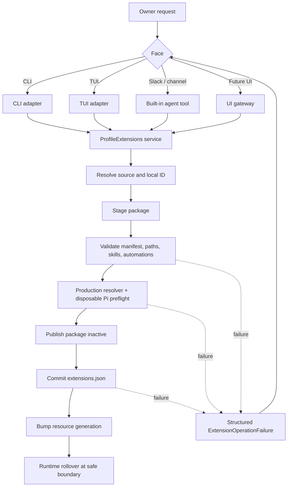
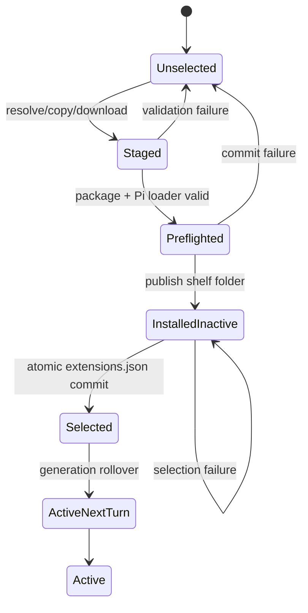
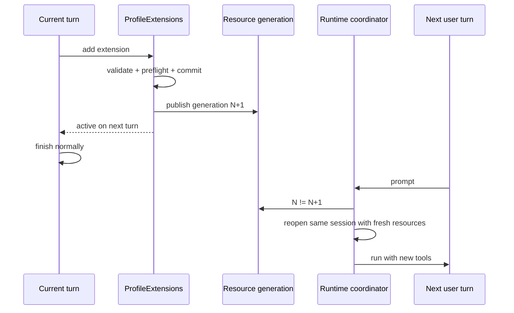

# First-class Profile extension lifecycle

## Orientation

Squarey's `computer-use` package exposed four separate defects:

1. Ziggy coupled the Profile shelf ID (`computer-use`) to the upstream package name
   (`@injaneity/pi-computer-use`) and rejected any package not named `@ziggy/<id>`.
2. Installation, validation, selection, automation provisioning, CLI, and TUI split ownership of
   one lifecycle, so an agent could edit files without proving the production path.
3. Agent guidance shells back into `ziggy`; a managed Slack process may not have Ziggy on `PATH`.
4. Pi resources are captured when a runtime opens, so selection changes require a reopen/restart.

The correction is one application-owned `ProfileExtensions` lifecycle used by every face. Package
folders may keep any valid upstream package identity. `extensions.json` remains the sole active-set
authority. Adding is the public transaction boundary; there is no separate publish command.

## Settled decisions

| Decision | Result |
| --- | --- |
| Local extension ID | Folder/selection key such as `computer-use` |
| Package identity | Untouched upstream `package.json.name` |
| Package location | `<profile>/extensions/<id>/`; storage, not an npm namespace |
| Active set | `extensions.json` remains authoritative |
| Public operation | `extensions add`; no `extension_publish` command |
| Internal commit | Stage → validate → Pi preflight → select → refresh |
| Agent behavior | Call an in-process Ziggy tool; never shell into `ziggy` |
| Sources | Existing Profile folder, bundled catalog ID, local path, GitHub HTTPS URL |
| Validation | Exact resolver and Pi loader used in production |
| Failure rule | Preserve the prior active selection and return a structured failure |
| Runtime behavior | Current turn finishes; next turn uses the new extension set |
| Error projection | Same contract for CLI, TUI, agent tool, UI gateway, and future faces |
| Compatibility | Replace the split lifecycle directly; no compatibility layer |
| Package scripts | Never run `postinstall` or arbitrary lifecycle scripts |
| Updates | No implicit overwrite/update in the first implementation |

## Scope

In scope:

- Arbitrary upstream package names.
- One application service for list, add, remove, and validate.
- Existing shelf, catalog, local path, and GitHub sources.
- Exact production-equivalent preflight.
- First-class agent/TUI/CLI/future-UI access.
- Safe next-turn runtime rollover.
- Deterministic launchd command environment.

Out of scope:

- npm registry installation.
- Running package lifecycle scripts.
- Generic Git hosts.
- Automatic package updates or replacement.
- A second extension registry or active-set database.

## Target flow





An inactive package folder is allowed. It cannot affect Pi until its ID is in `extensions.json`.

## Reference set

Load before implementation:

- `AGENTS.md`
- `docs/research/minimal-ziggy-scout.md`
- `docs/research/pi-sdk-surface.md`
- `docs/research/daily-slack-extension-authoring.md`
- `docs/operations/slack.md`
- `.agents/skills/effect-runtime-boundaries/SKILL.md`
- `.agents/skills/effect-schema-boundaries/SKILL.md`
- `.agents/skills/effect-typed-errors/SKILL.md`
- `.agents/skills/effect-client-wrapper/SKILL.md`
- `.agents/skills/effect-tests/SKILL.md`
- `/Users/yesh/.ziggy/profiles/squarey/extensions/computer-use/package.json`
- `/Users/yesh/.ziggy/profiles/squarey/extensions.json`

The incident regression is shelf ID `computer-use`, package name
`@injaneity/pi-computer-use`, selected, accepted, and loaded.

## Implementation chunks

### Slice 1 — Remove the false package-name constraint

**Delivers:** Squarey's existing package passes manifest validation without being renamed.

**Load:**

- `src/adapters/fs/profile-extensions.ts`
- `src/adapters/pi/resources.ts`
- `test/adapters/pi/resources.test.ts`
- `test/application/profiles.test.ts`
- `extensions/extension-authoring/skills/extension-authoring/SKILL.md`
- `extensions/pi-packages/skills/pi-packages/SKILL.md`
- `docs/research/minimal-ziggy-scout.md`

**Change:** Keep local ID slug validation. Require a valid non-empty package name, but remove the
`manifest.name === "@ziggy/<id>"` requirement. Keep path, symlink, skill, automation, and resource
validation. Update authoring guidance and the specification to separate shelf identity from package
identity. Regenerate embedded resources rather than editing `src/generated/**`.

**Proof:** Add the exact Squarey regression to `resources.test.ts`, then run:

```sh
bun test test/adapters/pi/resources.test.ts
bun test test/application/profiles.test.ts
bun run generate:catalog
bun run check
```

### Slice 2 — Introduce one transactional application service

**Delivers:** CLI add/remove uses one complete lifecycle instead of coordinating `Profiles` and
`ExtensionCatalog` in `main.ts`.

**Load:**

- `src/application/extension-catalog.ts`
- `src/application/profiles.ts`
- `src/domain/profile.ts`
- `src/domain/extension-catalog.ts`
- `src/domain/cli.ts`
- `src/adapters/fs/profile-extensions.ts`
- `src/adapters/fs/extension-installer.ts`
- `src/adapters/fs/automation-files.ts`
- `src/adapters/pi/resources.ts`
- `src/faces/extensions-cli.ts`
- `src/main.ts`
- Corresponding tests under `test/application/` and `test/faces/`

**Add:**

```text
src/
├── domain/
│   └── profile-extension.ts       # source, result, typed failure schemas
├── application/
│   └── profile-extensions.ts      # sole lifecycle coordinator
└── adapters/pi/
    └── profile-extension-preflight.ts
```

The service owns `list`, `add`, `remove`, and `validate`. Mutation is serialized per Profile.
Selection is committed only after source resolution, package validation, automation conflict checks,
and disposable Pi preflight. A failed operation preserves selection bytes. A copied but unselected
folder may remain inactive. Remove extension mutation from `Profiles`, absorb or replace
`ExtensionCatalogService`, and make `main.ts` invoke only `ProfileExtensions`.

The preflight and production runtime must share one candidate-resource resolver. Preflight uses
`DefaultResourceLoader`, candidate extension and skill roots, constructs Pi services without a
provider call, fails on diagnostics or unresolved imports, and disposes all resources.

**Proof:** Invalid package, Pi import failure, or automation conflict preserves selection bytes;
repeated add is a no-op; an inactive package can be selected; CLI renders the structured stage and
reason.

### Slice 3 — Make extension management first-class in every face

**Delivers:** “Create/add this extension” works from Slack or TUI without `ziggy` on `PATH`.

**Load:**

- `src/adapters/pi/pi-agent.ts`
- `src/adapters/pi/profile-extension-selection.ts`
- `src/adapters/pi/ziggy-tui-extension.ts`
- `src/application/ui-gateway.ts`
- `src/domain/ui-gateway.ts`
- `src/faces/cli.ts`
- `src/faces/extensions-cli.ts`
- `src/main.ts`
- TUI, CLI, and UI gateway tests

**Add:** `src/adapters/pi/profile-extension-tool.ts` and a shared bounded result/error presenter if
needed.

The built-in `profile_extensions` tool supports `list`, `add`, `remove`, and `validate`. For an
agent-authored package, the agent writes `<profile>/extensions/<id>/...`, calls the tool with that
local source, and reports success only from its result. The tool calls `ProfileExtensions` directly;
it never invokes Bash, searches `PATH`, runs Ziggy, or edits `extensions.json`.

Every face receives the same operation, stage, ID, source, code, safe message, and
`selectionChanged` value. CLI projects bounded stderr/JSON, TUI notifies, the agent receives a
structured tool result, and the UI gateway exposes a stable typed response.

**Proof:** Run the tool with empty `PATH`; prove no process spawn; prove one failure code across CLI,
TUI, tool, and UI protocol; remove obsolete shell-based authoring guidance.

### Slice 4 — Add GitHub URL imports

**Delivers:** An owner can pull a third-party Pi package without modifying its package identity.

**Load:**

- `src/domain/extension-catalog.ts`
- `src/adapters/github/extension-catalog.ts`
- `src/adapters/fs/extension-installer.ts`
- `src/application/profile-extensions.ts`
- `catalog.json`
- Existing archive and catalog tests

A GitHub repository URL defaults its local ID from the repository slug; a local path defaults from
the directory basename; `--id` overrides either. Resolve mutable refs to immutable commits, download
a bounded archive, reject unsafe entries, preserve `package.json`, and optionally write `ziggy.json`
with source URL, resolved commit, and checksum. Never run lifecycle scripts. Unresolved dependencies
fail production preflight. Existing destinations fail rather than being replaced.

**Proof:** Unrelated npm name loads; branch resolves to a recorded commit; checksum, traversal,
symlink, and unresolved-import failures happen before selection; a sentinel `postinstall` never
runs.

### Slice 5 — Automatic safe runtime rollover

**Delivers:** No resident restart or TUI reopen after successful add/remove.

**Load:**

- `docs/research/pi-sdk-surface.md`
- `node_modules/@earendil-works/pi-coding-agent/dist/core/agent-session-runtime.d.ts`
- `node_modules/@earendil-works/pi-coding-agent/dist/core/agent-session-runtime.js`
- `node_modules/@earendil-works/pi-coding-agent/dist/core/resource-loader.d.ts`
- `node_modules/@earendil-works/pi-coding-agent/dist/modes/interactive/interactive-mode.d.ts`
- `src/application/agent.ts`
- `src/adapters/pi/pi-agent.ts`
- `src/adapters/pi/resources.ts`
- `src/adapters/pi/ziggy-tui-extension.ts`
- `src/application/slack-gateway.ts`
- Chat handle and gateway tests



Add a machine-owned generation marker under `.runtime/`, bumped only after lifecycle success.
Refactor Pi factories to rediscover resources on replacement. Keep a stable `ChatHandle` that
refreshes its internal runtime before the next prompt while preserving the Pi session and
subscribers. Never replace during an active turn. TUI schedules same-session replacement after the
command or turn settles. Start with a focused pinned-Pi API proof; if safe switching is unavailable,
move runtime ownership to an outer Ziggy loop rather than falling back to manual restart.

**Proof:** Add during a Slack turn; current turn finishes and the next sees the tool. Transcript stays
in one session. Removal applies next turn. Failed add does not bump generation. TUI refreshes without
reopening. Two chats refresh independently.

### Slice 6 — Managed-service PATH and installation hardening

**Delivers:** Extensions invoking normal user-installed commands work consistently under launchd.
This supports extension executables but is not the extension-management mechanism.

**Load:**

- `README.md`
- `scripts/install.sh`
- `test/tooling/install-script.test.ts`
- `src/adapters/bun/launchd-service.ts`
- `src/adapters/bun/systemd-service.ts`
- `src/application/resident-service.ts`
- `test/adapters/bun/resident-service-renderers.test.ts`
- `docs/operations/slack.md`

Keep the curl installer destination `~/.local/bin/ziggy`. Render deterministic `HOME`, `ZIGGY_HOME`,
and `PATH` for launchd, including `$HOME/.local/bin`, `/opt/homebrew/bin`, `/usr/local/bin`, and
system paths. Keep the Ziggy service argument absolute. Document that the in-process extension
lifecycle does not depend on this PATH.

**Proof:** Installer checksum/symlink protection remains; launchd contains the safe environment; a
managed fixture command resolves from `~/.local/bin`; standalone resident smoke passes.

## Verification matrix

| Contract | Proof |
| --- | --- |
| Arbitrary upstream package name works | Squarey `computer-use` regression |
| Invalid package never becomes active | Selection byte comparison |
| Real Pi loader is used | Disposable runtime loader test |
| Agent does not need `PATH` | Tool test with empty `PATH` |
| Folder alone remains inactive | Runtime resource test |
| All faces get the same failure | Shared projection tests |
| GitHub source is immutable | Commit/checksum assertion |
| No package scripts run | Sentinel `postinstall` test |
| Current turn is not interrupted | In-flight gateway test |
| Next turn gets fresh resources | Stable-handle rollover test |
| Failed add does not trigger refresh | Generation assertion |
| Repository stays valid | `bun run check && bun test` |
| Standalone matches source | `bun run smoke:binary` |

## Rollout

Ship Slice 1 and run Squarey's package through resource discovery. Ship Slice 2 before exposing the
agent tool. Slice 3 makes local/catalog operations first-class. Slice 4 adds third-party GitHub
sources. Slice 5 completes the no-restart contract. Slice 6 is independent operational hardening.

For each slice: use a Luna high read-only scout, Luna max implementation worker, Luna medium lint
worker, and fresh Sol medium read-only reviewer. The primary agent integrates, updates `LOG.md`, runs
focused and repository gates, and commits only the verified slice with approval. Preserve unrelated
working-tree changes.

## Risks

- Pi module caching means the first version supports add/remove, not in-place updates.
- Third-party code has host permissions; source and pinned commit must be visible.
- Unresolved external dependencies fail preflight; package lifecycle scripts do not run.
- Extension-owned automations must be preflighted and safely paused during removal.
- TUI same-session replacement must be proven against the pinned Pi version.
- Concurrent Profile mutations require one extension lock.

## Open decisions

These do not block Slices 1–3:

1. Accept GitHub repository-root URLs only, or `/tree/<ref>` URLs too. Recommendation: root only.
2. Add explicit replacement/update later. Recommendation: defer until add/remove and rollover are
   proven.
